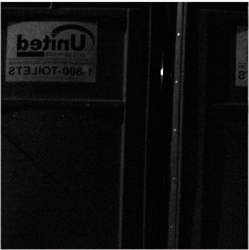
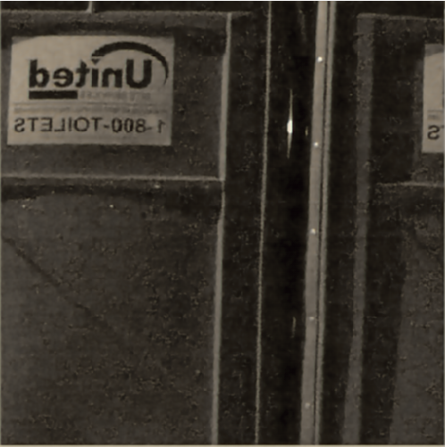
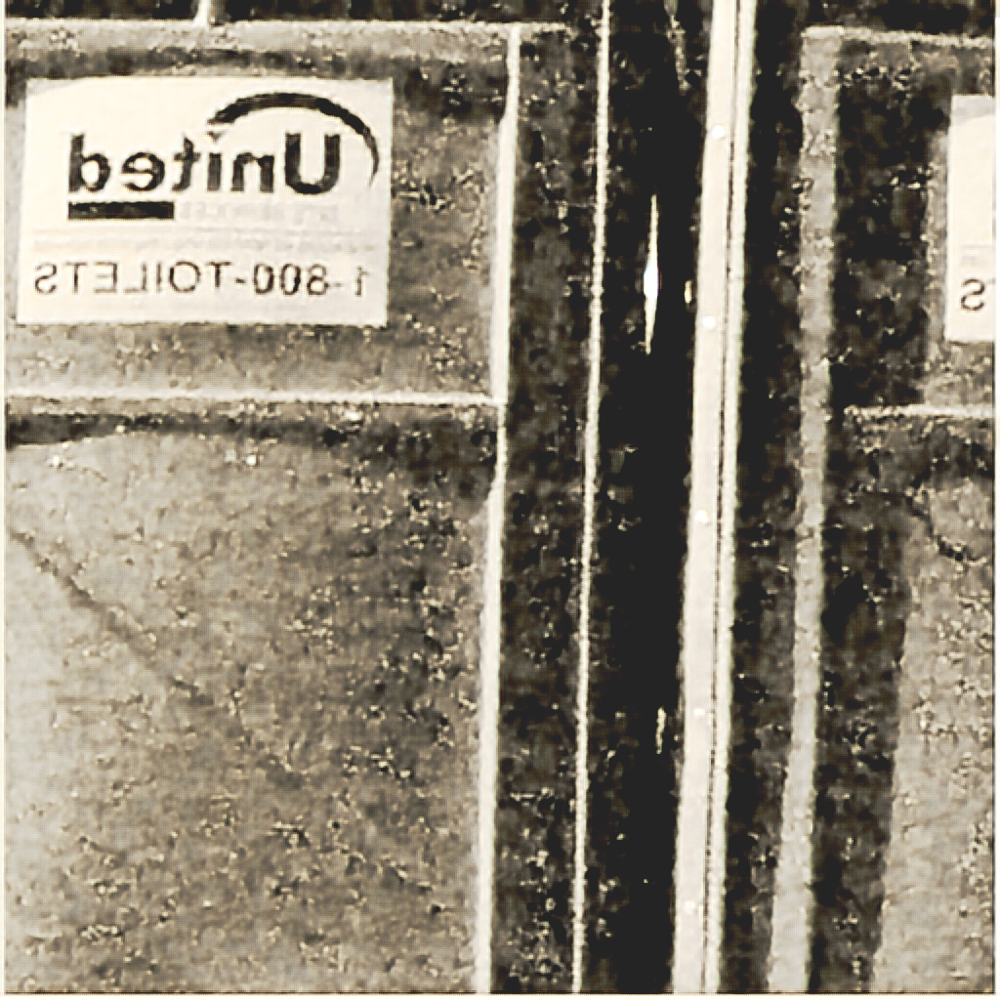

# Low-Light Image Enhancement  

### Assignment goal
Use MathWorks’ pretrained Sony low-light enhancement network on a real extremely dark photo **without** training or downloading the huge SID dataset.

### Key improvements I made
1. **Real dark image** – no artificial darkening needed (original is already almost pure black)
2. Added only minimal realistic sensor noise instead of heavy darkening
3. Fixed the `imadjust` error on RGB images  
   Replaced with proper RGB-compatible post-processing:
   ```matlab
   out = imlocalbrighten(out);
   out = imsharpen(out, 'Radius', 1.5, 'Amount', 1.2);
   out = histeq(out);
   ```
4. Clear before/after comparison (4-panel figure)

### Files in this repository
- `lowLightEnhance.m` – complete, error-free script (ready to run)
- `Example_03.png` – original extremely dark input image
- `light.png` – input to network (with light noise)
- `raw.png` – raw network output
- `enhanced_result.png` – final bright, sharp, and colorful output
- `README.md` – this file

### How to run
1. Put all files in the same folder
2. Run `lowLightEnhance.m` in MATLAB  
   (First run downloads the ~60 MB pretrained model automatically)
3. Enjoy the dramatic enhancement!

### Results
| Original (almost black) | Input to network | Raw network output | Final enhanced result |
|-------------------------|------------------|--------------------|-----------------------|
|      |     |   |  |

